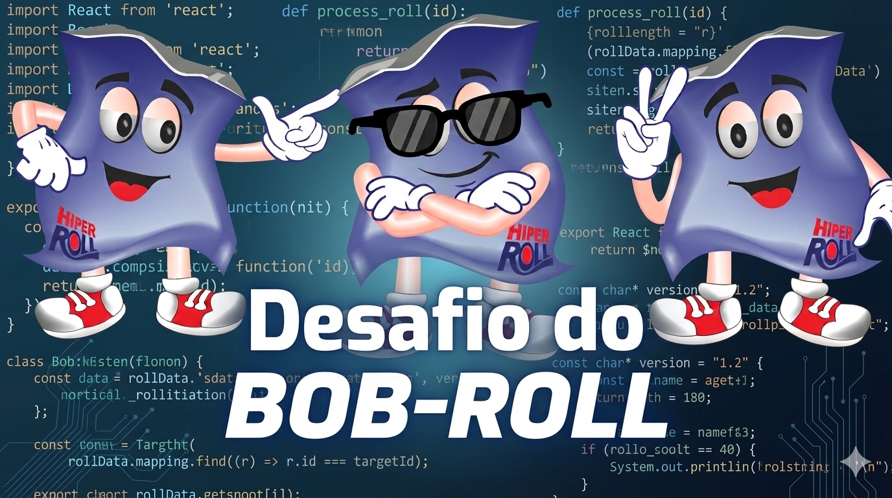
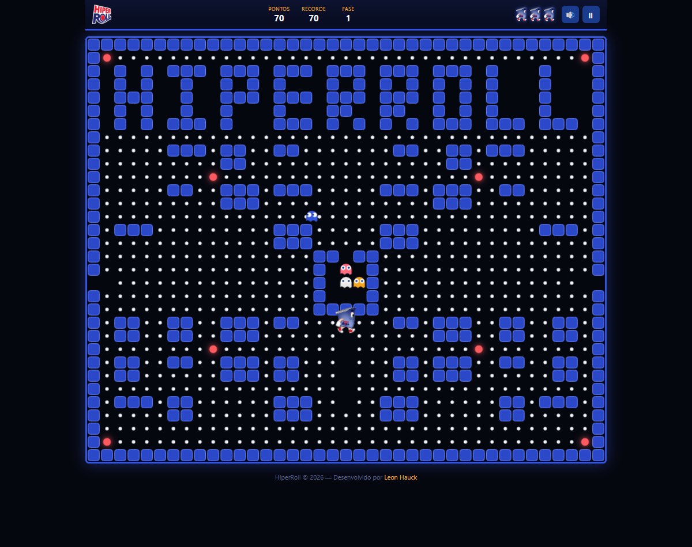
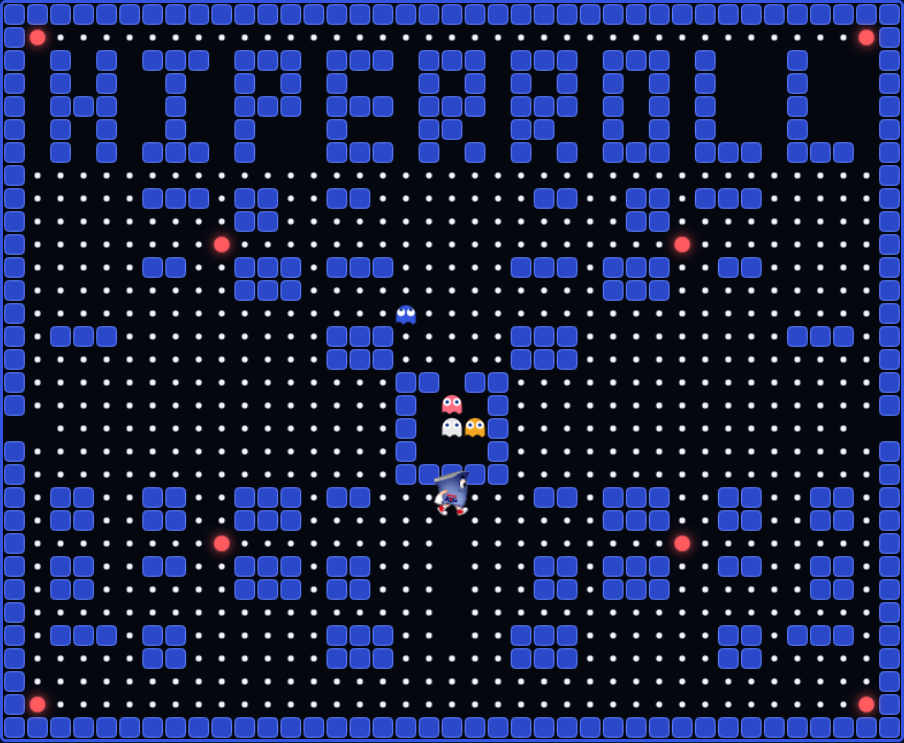

<div align="center">



# 🎮 O Desafio do BobRoll

### Um Pac-Man com a cara da HiperRoll — feito pra galera se divertir ☕


</div>

---

## 👀 O que é isso?

Um clone do clássico **Pac-Man**, todo temático da **HiperRoll**: labirinto onde os
blocos formam a palavra **HIPERROLL**, o mascote **BobRoll** no lugar do
Pac-Man, quatro rivais com nome e personalidade próprios, trilha eletrônica
tocando ao vivo, labirinto sorteado a cada fase e até um ranking pra ver quem
fecha o jogo com mais pontos.

100% HTML + CSS + JavaScript puro. Sem instalar nada, sem framework, sem
build — é só abrir e jogar. 🚀

<div align="center">

</div>

---

## ✨ Funcionalidades

- 🧱 **Labirinto com a marca escrita nos blocos** — o "HIPERROLL" é feito de
  parede, sempre visível no topo do tabuleiro
- 🎲 **Fase nova a cada rodada** — o miolo do labirinto é sorteado a cada
  fase (a moldura com o nome nunca muda, só o "recheio")
- 🧍 **BobRoll animado** — sprite de verdade andando, mastigando e virando
  pro lado que anda
- 👻 **4 rivais com IA própria**: cada um persegue o BobRoll de um jeito
  diferente (veja a tabela abaixo)
- ⚡ **Rolo/Turbo (power pellet)** — deixa os rivais vulneráveis, o tabuleiro
  pisca e a trilha sonora muda pro modo "perigo"
- 🎵 **Música eletrônica ao vivo**, gerada por código (nenhum arquivo de
  áudio, tudo Web Audio API)
- 🏆 **Ranking com pódio neon** (🥇🥈🥉) — local no navegador por padrão, e
  vira ranking compartilhado assim que hospedado com PHP (veja abaixo)
- 📱 **Funciona no celular** — controles touch e layout responsivo
- 🔊 Efeitos sonoros, pausa, mudo, vidas extra, recorde salvo — o pacote
  completo de um arcade de verdade

---

## 🕹️ Como jogar

| Ação | Teclado | Celular |
|---|---|---|
| Mover | Setas / `WASD` | Botões na tela |
| Pausar | `P`, `Espaço` ou `Esc` | Botão ⏸ no topo |
| Começar / Reiniciar | `Enter` | Botão na tela |

Colete todos os pontinhos, desvie do **Nó**, do **Emperro**, da **Poeira** e
do **Atraso**, e pegue o **Turbo** (bolinha grande) para virar o jogo e
derrotar os rivais! 😈➡️😱

### 👻 Os rivais

| Nome | Cor | Personalidade |
|---|---|---|
| 🔵 **Nó** | Azul | Persegue direto, sem enrolação |
| ⚪ **Emperro** | Branco | Tenta emboscar, mirando alguns passos à frente |
| 🟡 **Poeira** | Dourado | Persegue de longe, foge quando o BobRoll chega perto |
| 🌸 **Atraso** | Coral | Flanqueia, cercando por outro ângulo |

<div align="center">

</div>

---

## ▶️ Como rodar

Não precisa instalar nada:

1. Baixe (ou clone) este repositório
2. Abra o arquivo `index.html` no navegador — pronto, é só jogar

Se preferir rodar com um servidor local (opcional, útil pra testar o
ranking):

```bash
python -m http.server 8080
# depois acesse http://localhost:8080
```

## 🌐 Publicando com ranking compartilhado

O jogo já vem com um `leaderboard.php` pronto: é só subir todos os arquivos
pra uma hospedagem com PHP (ex: HostGator) e o ranking passa a ser
compartilhado entre todos que jogarem pelo link, sem precisar configurar
banco de dados. Enquanto isso não acontece, o jogo usa automaticamente um
ranking guardado no navegador de cada um.

---

## 🛠️ Tecnologia

- **HTML5 Canvas** pra todo o desenho do jogo
- **JavaScript puro** (sem framework, sem dependências, sem build step)
- **Web Audio API** pra música e efeitos sonoros gerados na hora
- **PHP + JSON** (opcional) pro ranking compartilhado

```
📁 Pacman-game-hiperroll/
├── index.html              → estrutura da página
├── style.css                → visual/tema
├── game.js                  → todo o jogo (labirinto, IA, áudio, ranking...)
├── leaderboard.php          → ranking compartilhado (opcional, precisa de PHP)
├── leaderboard.json         → onde o ranking compartilhado é guardado
├── bobroll-sheet.png        → sprite sheet do BobRoll
├── bobroll-icon.png         → ícone do BobRoll (vidas no HUD)
└── Novo-Logotipo-HiperRoll.png
```

---

<div align="center">

Feito na hora do café para a equipe HiperRoll se divertir!

**Desenvolvido por [Leon Hauck](https://www.linkedin.com/in/leon-hauck/)**

</div>
